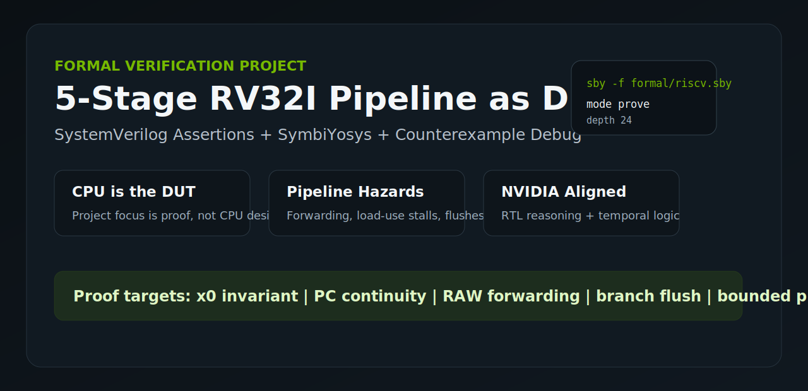
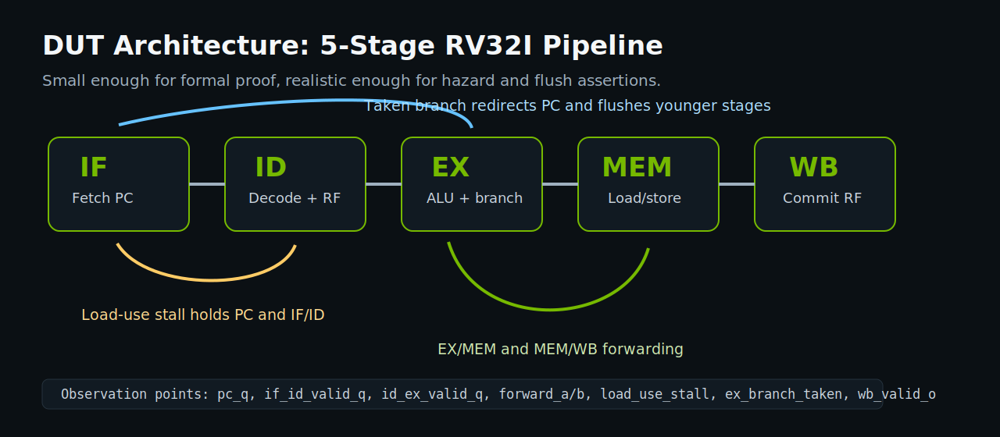
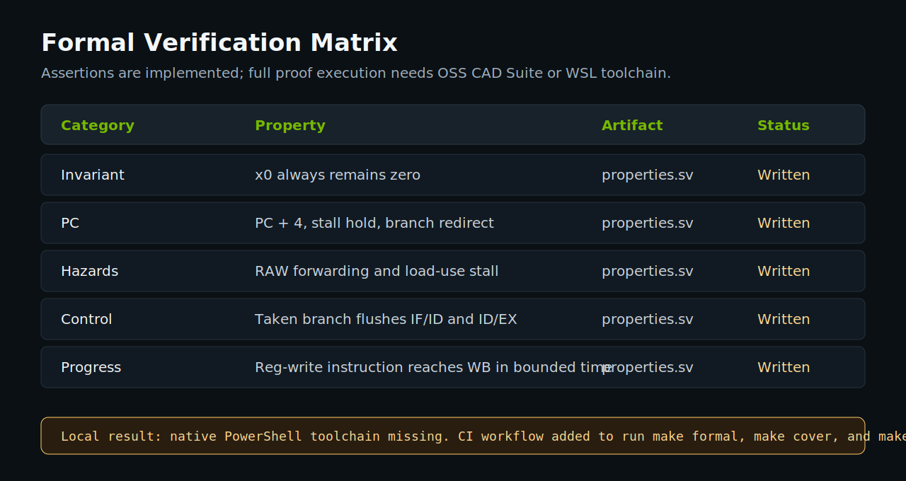
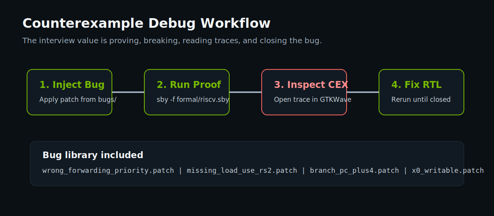
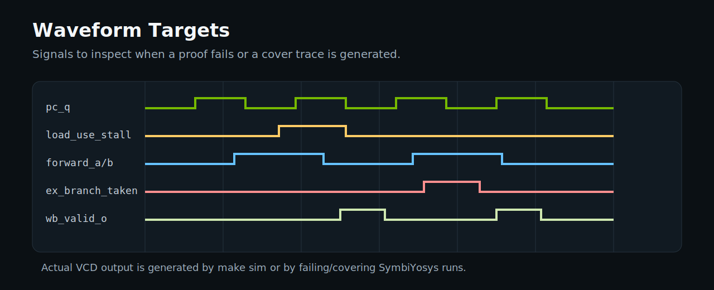

# Formal Verification of a 5-Stage RISC-V Pipelined Processor

<p align="center">
  
</p>

This repository is a **formal verification project**, not a CPU-design project.
The 5-stage RV32I processor is used as the DUT so the main engineering focus is
on RTL understanding, SystemVerilog Assertions, SymbiYosys proof setup,
bounded/cover verification, and counterexample-driven debug.

Target role alignment: **NVIDIA Formal Verification Engineer, New College
Graduate, JR2017808**.

## Table of Contents

- [Why This Project](#why-this-project)
- [Recruiter Snapshot](#recruiter-snapshot)
- [Architecture](#architecture)
- [Verification Scope](#verification-scope)
- [Screenshots and Visual Documentation](#screenshots-and-visual-documentation)
- [Current Results](#current-results)
- [Quick Start](#quick-start)
- [Intentional Bug Injection](#intentional-bug-injection)
- [Project Layout](#project-layout)
- [Documentation Index](#documentation-index)
- [Scope and Limitations](#scope-and-limitations)
- [Interview Pitch](#interview-pitch)

## Why This Project

Most student RTL projects stop at simulation: write Verilog, run a testbench,
inspect a waveform. This project is built around the verification workflow used
on real digital designs:

1. Understand the RTL behavior.
2. Define correctness properties.
3. Encode those properties as assertions.
4. Constrain the formal environment.
5. Run proof and cover tasks.
6. Debug counterexamples when assertions fail.
7. Fix RTL and show closure.

The processor is intentionally modest. It is complex enough to contain real
pipeline bugs such as RAW hazards, load-use stalls, forwarding priority errors,
and branch flush mistakes, but small enough that the verification story remains
explainable in an interview.

## Recruiter Snapshot

| NVIDIA signal | Evidence in this project |
| --- | --- |
| RTL comprehension | Modular 5-stage RV32I pipeline with fetch, decode, execute, memory, and writeback stages |
| HDL experience | SystemVerilog RTL for ALU, regfile, forwarding, hazard detection, branch, and core logic |
| Temporal logic assertions | Clocked assertion checks using `$past`, reset guards, pipeline timing, and bounded progress |
| Formal methodology | Separate harness, assumptions, proof config, cover config, and CI workflow |
| Abstraction | Formal instruction assumptions restrict the environment to a focused RV32I subset |
| Debug maturity | Bug patches intentionally break RTL to produce counterexample traces |
| Verification ownership | Verification plan, results log, bug-analysis workflow, setup guide, and resume bullets |

## Architecture

The DUT is a simplified RV32I 5-stage pipeline.

| Stage | Purpose | Verification relevance |
| --- | --- | --- |
| IF | Fetch instruction using current PC | PC continuity, branch redirect |
| ID | Decode instruction and read registers | Source/destination tracking, immediate generation |
| EX | ALU operation and branch decision | Forwarding correctness, branch target correctness |
| MEM | Data memory read/write | Load-use hazards, memory interface safety |
| WB | Register file writeback | x0 invariant, bounded progress |

Supported RV32I subset:

| Class | Instructions |
| --- | --- |
| R-type | `ADD`, `SUB`, `AND`, `OR`, `XOR`, `SLT` |
| I-type | `ADDI`, `ANDI`, `ORI`, `XORI`, `SLTI` |
| Memory | `LW`, `SW` |
| Branch | `BEQ` |

Unsupported encodings are treated as bubbles. This is deliberate: the goal is
to verify pipeline control and data behavior, not to implement the full RISC-V
ISA.

## Verification Scope

The formal environment is split into three parts:

| File | Role |
| --- | --- |
| `formal/formal_harness.sv` | Instantiates the DUT and provides unconstrained formal instruction/data inputs |
| `formal/assumptions.sv` | Restricts fetched instructions to the supported RV32I subset |
| `formal/properties.sv` | Contains the assertion and cover properties |
| `formal/riscv.sby` | SymbiYosys proof configuration |
| `formal/cover.sby` | SymbiYosys cover configuration |

Implemented property categories:

| Category | Property |
| --- | --- |
| Architectural invariant | `x0` always remains zero |
| PC sequencing | PC increments by 4 unless stalled or redirected |
| Load-use hazard | Dependent instruction stalls instead of reading stale data |
| Forwarding | EX/MEM forwarding has priority over MEM/WB forwarding |
| Writeback forwarding | MEM/WB is used when no newer EX/MEM producer exists |
| Control hazard | Taken branch redirects PC and flushes younger instructions |
| Interface safety | Data memory read and write are never both asserted |
| Bounded progress | Valid register-writing instruction reaches WB after pipeline latency |
| Cover targets | Writeback, load-use stall, and taken branch states are targeted for reachability |

## Screenshots and Visual Documentation

These visual assets are included directly in the repository so the README is
readable even before opening source files.

<p align="center">
  
</p>

<p align="center">
  
</p>

<p align="center">
  
</p>

<p align="center">
  
</p>

## Current Results

Local Windows PowerShell run using official OSS CAD Suite
`oss-cad-suite-windows-x64-20260517.exe` on **2026-05-18**:

| Item | Status |
| --- | --- |
| RTL modules | Complete |
| Formal harness and assumptions | Complete |
| Assertion and cover properties | Complete |
| SymbiYosys proof config | Complete |
| SymbiYosys cover config | Complete |
| Simulation smoke test | Complete |
| README visuals/screenshots | Complete |
| Intentional bug patches | Complete, patch-checked, and formally detected |
| GitHub Actions formal workflow | Complete |
| Local formal proof | PASS |
| Local formal cover | PASS |
| Local simulation | PASS |
| Waveform artifact | `waveforms/pipeline.vcd` generated |

Tool versions:

| Tool | Version |
| --- | --- |
| Yosys | `0.65+37` |
| SBY | `v0.65` |
| Boolector | `3.2.4` |
| Icarus Verilog | `14.0 devel` |

The Windows OSS CAD Suite package does not include `make`, so the local run was
executed through [scripts/run_all_windows.ps1](scripts/run_all_windows.ps1).
The Linux GitHub Actions workflow still uses the `Makefile`.

For the detailed result log, see [docs/results.md](docs/results.md).

## Quick Start

Recommended environment: WSL2 Ubuntu or OSS CAD Suite.

```sh
git clone <your-repo-url>
cd riscv-formal
make formal
make cover
make sim
```

Windows PowerShell with OSS CAD Suite extracted under `tools/`:

```powershell
powershell -ExecutionPolicy Bypass -File scripts/run_all_windows.ps1
```

Expected generated artifacts:

| Command | Output |
| --- | --- |
| `make formal` | `formal/riscv/` proof logs and traces |
| `make cover` | `formal/cover/` cover logs and traces |
| `make sim` | `waveforms/pipeline.vcd` |

Tool setup instructions are in [docs/tool_setup.md](docs/tool_setup.md).

On native Windows PowerShell, the helper script checks whether required tools
are available:

```powershell
powershell -ExecutionPolicy Bypass -File scripts/check_tools.ps1
```

## Intentional Bug Injection

The strongest part of this project is not just that assertions exist. The
project includes deliberate RTL bugs so the verification workflow can show
failure, trace inspection, root cause, and fix.

Example:

```sh
git apply bugs/bug01_wrong_forwarding_priority.patch
make formal
gtkwave formal/riscv/engine_0/trace.vcd
git apply -R bugs/bug01_wrong_forwarding_priority.patch
```

Bug library:

| Patch | Expected failure | Lesson |
| --- | --- | --- |
| `bug01_wrong_forwarding_priority.patch` | Formal FAIL observed | Newest producer must have priority |
| `bug02_missing_load_use_rs2.patch` | Formal FAIL observed | Both source operands must be checked |
| `bug03_branch_pc_plus4.patch` | Formal FAIL observed | Branch target must use branch instruction PC |
| `bug04_x0_writable.patch` | Formal FAIL observed | Architectural constants need hard RTL guards |

## Project Layout

```text
riscv-formal/
|-- rtl/
|   |-- core.sv
|   |-- alu.sv
|   |-- regfile.sv
|   |-- hazard_unit.sv
|   |-- forwarding_unit.sv
|   `-- branch_unit.sv
|-- formal/
|   |-- properties.sv
|   |-- assumptions.sv
|   |-- formal_harness.sv
|   |-- riscv.sby
|   `-- cover.sby
|-- sim/
|   `-- tb.sv
|-- bugs/
|   |-- README.md
|   |-- bug01_wrong_forwarding_priority.patch
|   |-- bug02_missing_load_use_rs2.patch
|   |-- bug03_branch_pc_plus4.patch
|   `-- bug04_x0_writable.patch
|-- docs/
|   |-- architecture.md
|   |-- verification_plan.md
|   |-- bug_analysis.md
|   |-- results.md
|   |-- nvidia_alignment.md
|   |-- resume_bullets.md
|   |-- tool_setup.md
|   `-- assets/
|-- scripts/
|   |-- check_tools.ps1
|   `-- run_formal.ps1
|-- waveforms/
|-- .github/workflows/formal.yml
|-- Makefile
`-- README.md
```

## Documentation Index

| Document | Purpose |
| --- | --- |
| [docs/architecture.md](docs/architecture.md) | Explains the CPU pipeline and supported ISA subset |
| [docs/verification_plan.md](docs/verification_plan.md) | Defines verification goals, properties, commands, and closure criteria |
| [docs/bug_analysis.md](docs/bug_analysis.md) | Describes intentional bugs and expected counterexample stories |
| [docs/results.md](docs/results.md) | Records current tool status and expected proof artifacts |
| [docs/nvidia_alignment.md](docs/nvidia_alignment.md) | Maps project evidence to NVIDIA formal verification requirements |
| [docs/resume_bullets.md](docs/resume_bullets.md) | Provides resume-ready bullets after proof results are generated |
| [docs/tool_setup.md](docs/tool_setup.md) | Explains tool installation and run commands |

## Scope and Limitations

This project intentionally avoids oversized CPU-design scope. It does not
attempt to implement out-of-order execution, caches, superscalar dispatch,
branch prediction, coherence, exceptions, interrupts, CSRs, or the complete
RV32I ISA.

That restraint is part of the design. A smaller DUT lets the verification work
be deeper, easier to explain, and more credible for a new-college-graduate
formal verification role.

## Interview Pitch

I used a compact 5-stage RISC-V pipeline as the DUT, then focused on proving
the behavior that commonly breaks pipelined RTL: x0 invariance, PC sequencing,
RAW forwarding, load-use stalls, branch flushes, memory interface safety, and
bounded writeback progress. I also added intentional RTL bugs so I can explain
how formal tools produce counterexamples and how those traces lead to root
cause and closure.

That is why this is positioned as a **formal verification project**, not as a
CPU-design project.
